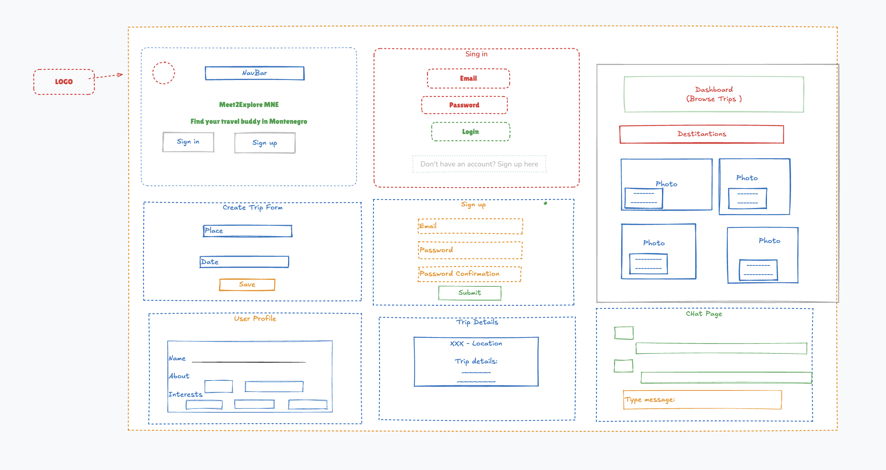

## 🌍 Meet2Explore — Connect, Explore & Travel Montenegro Together

## Meet2Explore is a social travel-planning platform designed specifically for Montenegro.

## Users can create trips, discover destinations, and connect with compatible travel partners — all in one place.

## 🚀 Features
🗺️ Create & Manage Trips

* Users can easily build customized travel plans with:

* Montenegro-only destinations

* Start & end dates

* Budget options: Low / Medium / High

* Travel styles: hiking, beach, road trip, culture, food tour, and more

* Maximum group size selection

## 💬 Real-Time Chat

* Stay connected with travel partners through integrated chat:

* 1-on-1 chat with matched partners

* Automatic group chat for each created trip

## 🏞️ Montenegro Destination Explorer

* A curated in-app guide featuring:

* Top places to visit

* Mountain + sea combination itineraries

* Photos, highlights, and must-do activities

* Perfect for travelers new to Montenegro or locals exploring hidden gems.

## 🧰 Tech Stack
* Frontend

* React

* React Router

* Axios

* CSS Modules / SCSS / Tailwind (depending on project setup)

* Backend

* Node.js

* Express

* Mongoose

* Database

* MongoDB Atlas

 

 

